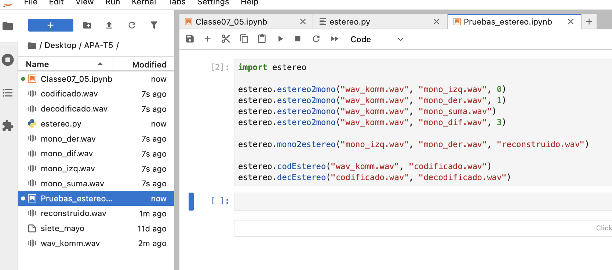

# Sonido estéreo y ficheros WAVE

## Nom i cognoms

> [!Important]
> Introduzca a continuación su nombre y apellidos:
>
> Marc Grau Casado

## Aviso Importante

> [!Caution]
> 
> El objetivo de esta tarea es manejar la lectura y escritura de ficheros binarios. Para ello, sólo se
> permite el uso de las funciones de la biblioteca `struct`. Aunque existen distintas bibliotecas que
> permiten manejar los ficheros WAVE de una manera más eficiente y sencilla, su uso está prohibido.
>
> ¿Quiere saber más?, consulte con el profesorado.

## Fecha de entrega: 24 de mayo a medianoche

## El formato WAVE

El formato WAVE es uno de los más extendidos para el almacenamiento y transmisión
de señales de audio. En el fondo, se trata de un tipo particular de fichero
[RIFF](https://en.wikipedia.org/wiki/Resource_Interchange_File_Format) (*Resource
Interchange File Format*), utilizado no sólo para señales de audio sino también para señales de
otros tipos, como las imágenes estáticas o en movimiento, o secuencias MIDI (aunque, en el caso
del MIDI, con pequeñas diferencias que los hacen incompatibles).

La base de los ficheros RIFF es el uso de *cachos* (*chunks*, en inglés). Cada cacho,
o subcacho, está encabezado por una cadena de cuatro caracteres ASCII, que indica el tipo del cacho,
seguido por un entero sin signo de cuatro bytes, que indica el tamaño en bytes de lo que queda de
cacho sin contar la cadena inicial y el propio tamaño. A continuación, y en función del tipo de
cacho, se colocan los datos que lo forman.

Todo fichero RIFF incluye un primer cacho que lo identifica como tal y que empieza por la cadena
`'RIFF'`. A continuación, después del tamaño del cacho y en otra cadena de cuatro caracteres,
se indica el tipo concreto de información que contiene el fichero. En el caso concreto de los
ficheros de audio WAVE, esta cadena es igual a `'WAVE'`, y el cacho debe contener dos
*subcachos*: el primero, de nombre `'fmt '`, proporciona la información de cómo está
codificada la señal. Por ejemplo, si es PCM lineal, ADPCM, etc., o si es monofónica o estéreo. El
segundo subcacho, de nombre `'data'`, incluye las muestras de la señal.

Dispone de una descripción detallada del formato WAVE en la página
[WAVE PCM soundfile format](http://soundfile.sapp.org/doc/WaveFormat/) de Soundfile.

## Audio estéreo

La mayor parte de los animales, incluidos los del género *homo sapiens sapiens* sanos y completos,
están dotados de dos órganos que actúan como transductores acústico-sensoriales (es decir, tienen dos
*oídos*). Esta duplicidad orgánica permite al bicho, entre otras cosas, determinar la dirección de
origen del sonido. En el caso de la señal de música, además, la duplicidad proporciona una sensación
de *amplitud espacial*, de realismo y de confort acústico.

En un principio, los equipos de reproducción de audio no tenían en cuenta estos efectos y sólo permitían
almacenar y reproducir una única señal para los dos oídos. Es el llamado *sonido monofónico* o
*monoaural*. Una alternativa al sonido monofónico es el *estereofónico* o, simplemente, *estéreo*. En
él, se usan dos señales independientes, destinadas a ser reproducidas a ambos lados del oyente: los
llamados *canal izquierdo* (**L**) y *derecho* (**R**).

Aunque los primeros experimentos con sonido estereofónico datan de finales del siglo XIX, los primeros
equipos y grabaciones de este tipo no se popularizaron hasta los años 1950 y 1960. En aquel tiempo, la
gestión de los dos canales era muy rudimentaria. Por ejemplo, los instrumentos se repartían entre los
dos canales, con unos sonando exclusivamente a la izquierda y el resto a la derecha. Es el caso de las
primeras grabaciones en estéreo de los Beatles: las versiones en alemán de los singles *She loves you*
y *I want to hold your hand*. Así, en esta última (de la que dispone de un fichero en Atenea con sus
primeros treinta segundos, [Komm, gib mir deine Hand](wav/komm.wav)), la mayor parte de los instrumentos
suenan por el canal derecho, mientras que las voces y las características palmas lo hacen por el izquierdo.

Un problema habitual en los primeros años del sonido estereofónico, y aún vigente hoy en día, es que no
todos los equipos son capaces de reproducir los dos canales por separado. La solución comúnmente
adoptada consiste en no almacenar cada canal por separado, sino en la forma semisuma, $(L+R)/2$, y
semidiferencia, $(L-R)/2$, y de tal modo que los equipos monofónicos sólo accedan a la primera de ellas.
De este modo, estos equipos pueden reproducir una señal completa, formada por la suma de los dos
canales, y los estereofónicos pueden reconstruir los dos canales estéreo.

Por ejemplo, en la radio FM estéreo, la señal, de ancho de banda 15 kHz, se transmite del modo siguiente:

- En banda base, $0\le f\le 15$ kHz, se transmite la suma de los dos canales, $L+R$. Esta es la señal
  que son capaces de reproducir los equipos monofónicos.

- La señal diferencia, $L-R$, se transmite modulada en amplitud con una frecuencia de portadora
  $f_m = 38$ kHz.

  - Por tanto, ocupa la banda $23 \mathrm{kHz}\le f\le 53 \mathrm{kHz}$, que sólo es accedida por los
    equipos estéreo, y, en el caso de colarse en un reproductor monofónico, ocupa la banda no audible.

- También se emite una sinusoide de $19 \mathrm{kHz}$, denominada *señal piloto*, que se usa para
  demodular síncronamente la señal diferencia.

- Finalmente, la señal de audio estéreo puede acompañarse de otras señales de señalización y servicio en
  frecuencias entre $55.35 \mathrm{kHz}$ y $94 \mathrm{kHz}$.

En los discos fonográficos, la semisuma de las señales está grabada del mismo modo que se haría en una
grabación monofónica, es decir, en la profundidad del surco; mientras que la semidiferencia se graba en el
desplazamiento a izquierda y derecha de la aguja. El resultado es que un reproductor mono, que sólo atiende
a la profundidad del surco, reproduce casi correctamente la señal monofónica, mientras que un reproductor
estéreo es capaz de separar los dos canales. Es posible que algo de la información de la semisuma se cuele
en el reproductor mono, pero, como su amplitud es muy pequeña, se manifestará como un ruido muy débil,
apenas perceptible.

En general, todos estos sistemas se basan en garantizar que el reproductor mono recibe correctamente la
semisuma de canales y que, si algo de la semidiferencia se cuela en la reproducción, sea en forma de un
ruido inaudible.

## Tareas a realizar

Escriba el fichero `estereo.py` que incluirá las funciones que permitirán el manejo de los canales de una
señal estéreo y su codificación/decodificación para compatibilizar ésta con sistemas monofónicos.


### Manejo de los canales de una señal estéreo

En un fichero WAVE estéreo con señales de 16 bits, cada muestra de cada canal se codifica con un entero de
dos bytes. La señal se almacena en el *cacho* `'data'` alternando, para cada muestra de $x[n]$, el valor
del canal izquierdo y el derecho:


#### Función `estereo2mono(ficEste, ficMono, canal=2)`

La función lee el fichero `ficEste`, que debe contener una señal estéreo, y escribe el fichero `ficMono`,
con una señal monofónica. El tipo concreto de señal que se almacenará en `ficMono` depende del argumento
`canal`:

- `canal=0`: Se almacena el canal izquierdo $L$.
- `canal=1`: Se almacena el canal derecho $R$.
- `canal=2`: Se almacena la semisuma $(L+R)/2$. Ha de ser la opción por defecto.
- `canal=3`: Se almacena la semidiferencia $(L-R)/2$.

#### Función `mono2estereo(ficIzq, ficDer, ficEste)`

Lee los ficheros `ficIzq` y `ficDer`, que contienen las señales monofónicas correspondientes a los canales
izquierdo y derecho, respectivamente, y construye con ellas una señal estéreo que almacena en el fichero
`ficEste`.

### Codificación estéreo usando los bits menos significativos

En la línea de los sistemas usados para codificar la información estéreo en señales de radio FM o en los
surcos de los discos fonográficos, podemos usar enteros de 32 bits para almacenar los dos canales de 16 bits:

- En los 16 bits más significativos se almacena la semisuma de los dos canales.

- En los 16 bits menos significativos se almacena la semidiferencia.

Los sistemas monofónicos sólo son capaces de manejar la señal de 32 bits. Esta señal es prácticamente
idéntica a la señal semisuma, ya que la semisuma ocupa los 16 bits más significativos. La señal
semidiferencia aparece como un ruido añadido a la señal, pero, como su amplitud es $2^{16}$ veces más
pequeña, será prácticamente inaudible (la relación señal a ruido es del orden de 90 dB).

Los sistemas estéreo son capaces de aislar las dos partes de la señal y, con ellas, reconstruir los dos
canales izquierdo y derecho.


#### Función `codEstereo(ficEste, ficCod)`

Lee el fichero `ficEste`, que contiene una señal estéreo codificada con PCM lineal de 16 bits, y
construye con ellas una señal codificada con 32 bits que permita su reproducción tanto por sistemas
monofónicos como por sistemas estéreo preparados para ello.

#### Función `decEstereo(ficCod, ficEste)`

Lee el fichero `ficCod` con una señal monofónica de 32 bits en la que los 16 bits más significativos
contienen la semisuma de los dos canales de una señal estéreo y los 16 bits menos significativos la
semidiferencia, y escribe el fichero `ficEste` con los dos canales por separado en el formato de los
ficheros WAVE estéreo.

### Entrega

#### Fichero `estereo.py`

- El fichero debe incluir una cadena de documentación que incluirá el nombre del alumno y una descripción
  del contenido del fichero.

- Es muy recomendable escribir, además, sendas funciones que *empaqueten* y *desempaqueten* las cabeceras
  de los ficheros WAVE a partir de los datos contenidos en ellas.

- Aparte de `struct`, no se puede importar o usar ningún módulo externo.

- Se deben evitar los bucles. Se valorará el uso, cuando sea necesario, de *comprensiones*.

- Los ficheros se deben abrir y cerrar usando gestores de contexto.

- Las funciones deberán comprobar que los ficheros de entrada tienen el formato correcto y, en caso
  contrario, elevar la excepción correspondiente.

- Los ficheros resultantes deben ser reproducibles correctamente usando cualquier reproductor estándar;
  por ejemplo, el Windows Media Player o similar. Es probable, muy probable, que tenga que modificar los
  datos de las cabeceras de los ficheros para conseguirlo.

- Se valorará lo pythónico de la solución; en concreto, su claridad y sencillez, y el uso de los estándares
  marcados por PEP-ocho.

#### Comprobación del funcionamiento

Es responsabilidad del alumno comprobar que las distintas funciones realizan su cometido de manera correcta.
Para ello, se recomienda usar la canción [Komm, gib mir deine Hand](wav/komm.wav), suminstrada al efecto.
De todos modos, recuerde que, aunque sea en alemán, se trata de los Beatles, así que procure no destrozar
innecesariamente la canción.

Para comprobar el funcionamiento de las funciones desarrolladas, se ha ejecutado el siguiente código desde JupyterLab:

```python
import estereo

estereo.estereo2mono("wav_komm.wav", "mono_izq.wav", 0)
estereo.estereo2mono("wav_komm.wav", "mono_der.wav", 1)
estereo.estereo2mono("wav_komm.wav", "mono_suma.wav")
estereo.estereo2mono("wav_komm.wav", "mono_dif.wav", 3)

estereo.mono2estereo("mono_izq.wav", "mono_der.wav", "reconstruido.wav")

estereo.codEstereo("wav_komm.wav", "codificado.wav")
estereo.decEstereo("codificado.wav", "decodificado.wav")
```



Para comprobar el funcionamiento de las funciones desarrolladas, se ha utilizado el fichero `wav_komm.wav`. A partir de este fichero se han generado correctamente los ficheros mono, el fichero estéreo reconstruido, el fichero codificado en 32 bits y el fichero decodificado, comprobando posteriormente que todos podían reproducirse correctamente.

#### Código desarrollado

Inserte a continuación el código de los métodos desarrollados en esta tarea, usando los comandos necesarios
para que se realice el realce sintáctico en Python del mismo (no vale insertar una imagen o una captura de
pantalla, debe hacerse en formato *markdown*).

##### Funciones auxiliares utilizadas

```python
import struct

def _lee_wave(nombre):
    """Lee un fichero WAVE PCM y devuelve su cabecera y sus muestras."""
    with open(nombre, "rb") as fichero:
        riff = fichero.read(12)

        if len(riff) != 12:
            raise ValueError("El fichero no contiene una cabecera RIFF válida")

        chunk_id, chunk_size, formato = struct.unpack("<4sI4s", riff)

        if chunk_id != b"RIFF" or formato != b"WAVE":
            raise ValueError("El fichero no tiene formato WAVE")

        fmt = None
        datos = None

        while True:
            cabecera_cacho = fichero.read(8)

            if len(cabecera_cacho) == 0:
                break

            if len(cabecera_cacho) != 8:
                raise ValueError("Cacho WAVE incompleto")

            nombre_cacho, tamanyo_cacho = struct.unpack("<4sI", cabecera_cacho)
            contenido = fichero.read(tamanyo_cacho)

            if len(contenido) != tamanyo_cacho:
                raise ValueError("Datos incompletos en el fichero WAVE")

            if nombre_cacho == b"fmt ":
                if tamanyo_cacho < 16:
                    raise ValueError("El cacho fmt no tiene el tamaño correcto")

                fmt = struct.unpack("<HHIIHH", contenido[:16])

            elif nombre_cacho == b"data":
                datos = contenido

            if tamanyo_cacho % 2 == 1:
                fichero.read(1)

        if fmt is None or datos is None:
            raise ValueError("El fichero WAVE no contiene fmt o data")

        audio_format, canales, frecuencia, byte_rate, block_align, bits = fmt

        if audio_format != 1:
            raise ValueError("Sólo se admiten ficheros PCM lineales")

        if bits not in (16, 32):
            raise ValueError("Sólo se admiten muestras de 16 o 32 bits")

        bytes_muestra = bits // 8

        if len(datos) % bytes_muestra != 0:
            raise ValueError("El tamaño de data no coincide con el formato")

        formato_muestra = "h" if bits == 16 else "i"
        num_muestras = len(datos) // bytes_muestra
        muestras = struct.unpack("<" + formato_muestra * num_muestras, datos)

        return {
            "canales": canales,
            "frecuencia": frecuencia,
            "bits": bits,
            "muestras": muestras,
        }


def _escribe_wave(nombre, canales, frecuencia, bits, muestras):
    """Escribe un fichero WAVE PCM a partir de sus datos básicos."""
    if bits not in (16, 32):
        raise ValueError("Sólo se pueden escribir muestras de 16 o 32 bits")

    formato_muestra = "h" if bits == 16 else "i"
    datos = struct.pack("<" + formato_muestra * len(muestras), *muestras)

    bytes_muestra = bits // 8
    block_align = canales * bytes_muestra
    byte_rate = frecuencia * block_align
    tamanyo_data = len(datos)
    tamanyo_riff = 36 + tamanyo_data

    with open(nombre, "wb") as fichero:
        fichero.write(struct.pack("<4sI4s", b"RIFF", tamanyo_riff, b"WAVE"))

        fichero.write(struct.pack("<4sI", b"fmt ", 16))
        fichero.write(struct.pack(
            "<HHIIHH",
            1,
            canales,
            frecuencia,
            byte_rate,
            block_align,
            bits,
        ))

        fichero.write(struct.pack("<4sI", b"data", tamanyo_data))
        fichero.write(datos)


def _satura_16(valor):
    """Limita un valor al rango de una muestra PCM de 16 bits."""
    return max(-32768, min(32767, valor))


def _a_entero_16(valor):
    """Convierte los 16 bits menos significativos en entero con signo."""
    return valor - 65536 if valor >= 32768 else valor
```

##### Código de `estereo2mono()`
```python
def estereo2mono(ficEste, ficMono, canal=2):
    """
    Lee un fichero WAVE estéreo de 16 bits y escribe un fichero mono.

    canal=0: canal izquierdo.
    canal=1: canal derecho.
    canal=2: semisuma (L + R) / 2.
    canal=3: semidiferencia (L - R) / 2.
    """
    wave = _lee_wave(ficEste)

    if wave["canales"] != 2 or wave["bits"] != 16:
        raise ValueError("El fichero de entrada debe ser estéreo de 16 bits")

    if canal not in (0, 1, 2, 3):
        raise ValueError("El canal debe ser 0, 1, 2 o 3")

    muestras = wave["muestras"]
    pares = zip(muestras[0::2], muestras[1::2])

    if canal == 0:
        salida = muestras[0::2]
    elif canal == 1:
        salida = muestras[1::2]
    elif canal == 2:
        salida = tuple((izq + der) // 2 for izq, der in pares)
    else:
        salida = tuple((izq - der) // 2 for izq, der in pares)

    _escribe_wave(ficMono, 1, wave["frecuencia"], 16, salida)
```


##### Código de `mono2estereo()`
```python
def mono2estereo(ficIzq, ficDer, ficEste):
    """
    Lee dos ficheros WAVE mono de 16 bits y construye un fichero estéreo.
    """
    izquierdo = _lee_wave(ficIzq)
    derecho = _lee_wave(ficDer)

    if izquierdo["canales"] != 1 or derecho["canales"] != 1:
        raise ValueError("Los dos ficheros de entrada deben ser mono")

    if izquierdo["bits"] != 16 or derecho["bits"] != 16:
        raise ValueError("Los dos ficheros de entrada deben ser de 16 bits")

    if izquierdo["frecuencia"] != derecho["frecuencia"]:
        raise ValueError("Los ficheros deben tener la misma frecuencia")

    if len(izquierdo["muestras"]) != len(derecho["muestras"]):
        raise ValueError("Los ficheros deben tener el mismo número de muestras")

    salida = tuple(
        muestra
        for par in zip(izquierdo["muestras"], derecho["muestras"])
        for muestra in par
    )

    _escribe_wave(ficEste, 2, izquierdo["frecuencia"], 16, salida)
```

##### Código de `codEstereo()`
```python
def codEstereo(ficEste, ficCod):
    """
    Codifica una señal estéreo de 16 bits en una señal mono de 32 bits.

    Los 16 bits más significativos contienen la semisuma.
    Los 16 bits menos significativos contienen la semidiferencia.
    """
    wave = _lee_wave(ficEste)

    if wave["canales"] != 2 or wave["bits"] != 16:
        raise ValueError("El fichero de entrada debe ser estéreo de 16 bits")

    muestras = wave["muestras"]

    codificadas = tuple(
        (((izq + der) // 2) << 16) | (((izq - der) // 2) & 0xFFFF)
        for izq, der in zip(muestras[0::2], muestras[1::2])
    )

    _escribe_wave(ficCod, 1, wave["frecuencia"], 32, codificadas)
```

##### Código de `decEstereo()`
```python
def decEstereo(ficCod, ficEste):
    """
    Decodifica una señal mono de 32 bits y reconstruye una señal estéreo.
    """
    wave = _lee_wave(ficCod)

    if wave["canales"] != 1 or wave["bits"] != 32:
        raise ValueError("El fichero de entrada debe ser mono de 32 bits")

    pares = (
        (
            _satura_16((muestra >> 16) + _a_entero_16(muestra & 0xFFFF)),
            _satura_16((muestra >> 16) - _a_entero_16(muestra & 0xFFFF)),
        )
        for muestra in wave["muestras"]
    )

    salida = tuple(valor for par in pares for valor in par)

    _escribe_wave(ficEste, 2, wave["frecuencia"], 16, salida)
```

#### Subida del resultado al repositorio GitHub y *pull-request*

La entrega se formalizará mediante *pull request* al repositorio de la tarea.

El fichero `README.md` deberá respetar las reglas de los ficheros Markdown y visualizarse correctamente en
el repositorio, incluyendo el realce sintáctico del código fuente insertado.
